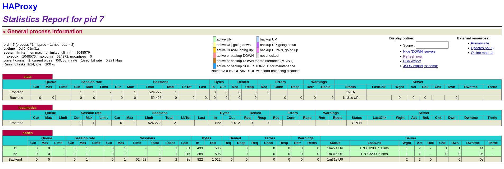
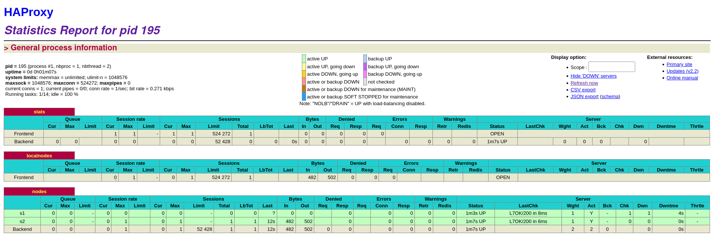
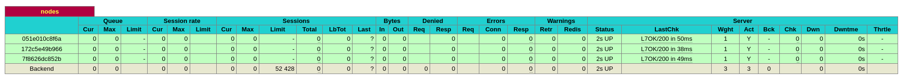
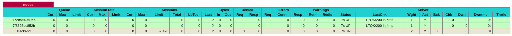
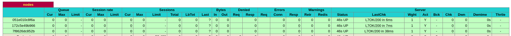

# AIT - Labo 4 : Docker

Authors : Peguiron A., Viotti N., Wènes L. - 03.01.2022

#### Table of content

[Introduction](#intro)

[Task 0](#task0)

[Task 1](#task1)

[Task 2](#task2)

[Task 3](#task3)

[Task 4](#task4)

[Task 5](#task5)

[Task 6](#task6)

[Difficulties](#diff)

[Conclusion](#conc)  

<a name="intro"/>

#### Introduction

In this lab, we have a more in depth look into load balancers and the issues with the configuration of the preceding lab. The lab starts of by identifying 6 issues with the previous infrastructure, and then we resolve them step by step by adding new functionalities/improvements. Multiple technologies are used like a process supervisor, a tool to manage membership and a template engine.

<a name="task0"/>

> ### Task 0: Identify issues and install the tools
>
> #### Identify issues
>
> 1. **[M1]** Do you think we can use the current solution for a production environment? What are the main problems when deploying it in a production environment?

No, we cannot use our current solution for a production environment. There is no automated process for adding dynamically new server nodes when the traffic hits the roof. 

> 2. **[M2]** Describe what you need to do to add new `webapp` container to the infrastructure. Give the exact steps of what you have to do without modifiying the way the things are done. Hint: You probably have to modify some configuration and script files in a Docker image.

First of all, we need to reconfigure (edit config file and .env file) HA proxy so that it can serve the new webapp.  

Secondly, we edit the _docker-compose_ file so that we can build a new container that contains the files of the new _webapp_ . 

Last step is to rebuild the containers in the docker compose file and execute them as a final step . 

> 3. **[M3]** Based on your previous answers, you have detected some issues in the current solution. Now propose a better approach at a high level.

We can add a mechanism that detects the load rate on the HAProxy, if we reach a certain level on both nodes , we launch an automated script that adds new node till the load is back to normal rates.

> 4. **[M4]** You probably noticed that the list of web application nodes is hardcoded in the load balancer configuration. How can we manage the web app nodes in a more dynamic fashion?

We have to edit HAProxy config file, that it detects new nodes. There exists a set of discovery tools that detects a new node is added/deleted  to/from the pool. 

> 5. **[M5]** In the physical or virtual machines of a typical infrastructure we tend to have not only one main process (like the web server or the load balancer) running, but a few additional processes on the side to perform management tasks.
>
>    For example to monitor the distributed system as a whole it is common to collect in one centralized place all the logs produced by the different machines. Therefore we need a process running on each machine that will forward the logs to the central place. (We could also imagine a central tool that reaches out to each machine to gather the logs. That's a push vs. pull problem.) It is quite common to see a push mechanism used for this kind of task.
>
>    Do you think our current solution is able to run additional management processes beside the main web server / load balancer process in a container? If no, what is missing / required to reach the goal? If yes, how to proceed to run for example a log forwarding process?

The central tenet of Docker design architecture is one service per container. Hence we can not run additional management processes beside the main web server / load balancer. We have to install a process supervisor.  

> 6. **[M6]** In our current solution, although the load balancer configuration is changing dynamically, it doesn't follow dynamically the configuration of our distributed system when web servers are added or removed. If we take a closer look at the `run.sh` script, we see two calls to `sed` which will replace two lines in the `haproxy.cfg` configuration file just before we start `haproxy`. You clearly see that the configuration file has two lines and the script will replace these two lines.
>
>    What happens if we add more web server nodes? Do you think it is really dynamic? It's far away from being a dynamic configuration. Can you propose a solution to solve this?

One line in the script adds a server to the pool of HAProxy. To be able to add more servers , we have to add more **sed** commands to the scripts (server per command). 
But this solution, automated it might seem, but it's dynamic because we have to run the script, and we have to check everytime if we have to add another server or not. 
In this case, we have to write a script the generate  HAProxy config file.   

> #### Install the tools
>
> 1. Take a screenshot of the stats page of HAProxy at [http://192.168.42.42:1936](http://192.168.42.42:1936/). You should see your backend nodes.



>  ​	  2. Give the URL of your repository URL in the lab report.

https://github.com/AdrienPeg/Teaching-HEIGVD-AIT-2020-Labo-Docker

<a name="task1"/>

> ### Task 1: Add a process supervisor to run several processes
>
> **Deliverables:**
>
> 1. Take a screenshot of the stats page of HAProxy at [http://192.168.42.42:1936](http://192.168.42.42:1936/). You should see your backend nodes. It should be really similar to the screenshot of the previous task.



> 2. Describe your difficulties for this task and your understanding of what is happening during this task. Explain in your own words why are we installing a process supervisor. Do not hesitate to do more research and to find more articles on that topic to illustrate the problem

In this task, we installed a process supervisor called `S6`. This allows multiple process to be ran at once in a docker container. Normally, a docker container can only run one process and, when it's over, the container stops as well.

To use this process supervisor, we must first change the dockerfiles of the webapps and HAProxy to install `s6` , start it as the main process in the containers and give it a starting script. Once it is done, the images must be rebuilt and the containers rerun.

We had no real difficulties during this task as it was well documented.

<a name="task2"/>

> ### Task 2: Add a tool to manage membership in the web server cluster
>
> **Deliverables:**
>
> 1. Provide the docker log output for each of the containers: `ha`, `s1` and `s2`. You need to create a folder `logs` in your repository to store the files separately from the lab report. For each lab task create a folder and name it using the task number. No need to create a folder when there are no logs.

The logs are available in `logs\task2`

> 2. Give the answer to the question about the existing problem with the current solution.

The issue is that the different nodes will try to connect to the `Serf` cluster via `ha`. If `ha` is not running, they are not able to join the cluster.

Instead of connecting via `ha`, the nodes should connect to the cluster via the latest node who joined the cluster.

> 3. Give an explanation on how `Serf` is working. Read the official website to get more details about the `GOSSIP` protocol used in `Serf`. Try to find other solutions that can be used to solve similar situations where we need some auto-discovery mechanism.

`GOSSIP` protocols are `infection-style` protocols. If a node wants to share information, it will share it among a subset of its peers who will then share it among a subset of their own peers until every node in the cluster got the information. 

`Serf` uses this protocol to look for dead nodes. Periodic random probing is used and if a node doesn't respond within a reasonable time, an indirect probe will be attempted. Indirect probing means random nodes will try to probe the failing node. If the indirect probe also fails, the note is registered as suspicious. After some time, if the node hasn't disputed the suspicion, it is considered dead and not a part of the cluster anymore. 

<a name="task3"/>

> ###  Task 3: React to membership changes
>
> **Deliverables:**
>
> 1. Provide the docker log output for each of the containers: `ha`, `s1` and `s2`. Put your logs in the `logs` directory you created in the previous task.
> 2. Provide the logs from the `ha` container gathered directly from the `/var/log/serf.log` file present in the container. Put the logs in the `logs` directory in your repo.

The logs are available in `logs/task3`

<a name="task4"/>

> ### Task 4: Use a template engine to easily generate configuration files
>
> 1. You probably noticed when we added `xz-utils`, we have to rebuild the whole image which took some time. What can we do to mitigate that? Take a look at the Docker documentation on [image layers](https://docs.docker.com/engine/userguide/storagedriver/imagesandcontainers/#images-and-layers). Tell us about the pros and cons to merge as much as possible of the command. In other words, compare:
>
> ```
> RUN command 1
> RUN command 2
> RUN command 3
> ```
>
> ​	vs.
>
> ```
> RUN command 1 && command 2 && command 3
> ```

A layer will only be run if it has been modified (or if it has never been run). Otherwise, it will be taken from the cache.

The first options adds more layers but, if the commands have already been run, a lot of time will be gained thanks to the cache. The second option only takes one layer but if one of the command needs to be rerun, they all will be rerun and it can take a lot of time.

Layers are also pulled in parallel from Docker Hub. That means the first option, despite being slightly heavier in size, would get downloaded faster.

Source : https://stackoverflow.com/questions/39223249/multiple-run-vs-single-chained-run-in-dockerfile-which-is-better

> There are also some articles about techniques to reduce the image size. Try to find them. They are talking about `squashing` or `flattening` images.

`Squashing` an image will merge multiple layer into one to have fewer and smaller layer in the final image.

Also, deleted files in later layer are purged from the image when it is squashed instead of just being covered.

source : https://blog.codacy.com/five-ways-to-slim-your-docker-images/

`Flattening` an image is done by running a container with the image, exporting its file system to an archive and importing the archive to a new image. The new image will have only one layer.

source : https://acloudxpert.com/flattening-a-docker-image-to-a-single-layer/ 

> 2. Propose a different approach to architecture our images to be able to reuse as much as possible what we have done. Your proposition should also try to avoid as much as possible repetitions between your images.

We could use a new docker image called `teaching-heigvd-ait-2020-labo-docker_base` which contains all the common configuration from both current Dockerfiles. The images for `ha` and the `webapps` would then inherit from this image. This would make both images lighter, and reduce greatly redundancy. 

> 3. Provide the `/tmp/haproxy.cfg` file generated in the `ha` container after each step. Place the output into the `logs` folder like you already did for the Docker logs in the previous tasks. Three files are expected.
>
>    In addition, provide a log file containing the output of the `docker ps` console and another file (per container) with `docker inspect <container>`. Four files are expected.

The logs are available in `logs/task4`

> 4. Based on the three output files you have collected, what can you say about the way we generate it? What is the problem if any?

Every output file will replace the last one. With this approach, it is not possible to keep logs.

<a name="task5"/>

> ### Task 5: Generate a new load balancer configuration when membership changes
>
> **Deliverables:**

All the logs are available in `logs/task5`

<a name="task6"/>

> ### Task 6: Make the load balancer automatically reload the new configuration
>
> **Deliverables:**
>
> 1. Take a screenshots of the HAProxy stat page showing more than 2 web applications running. Additional screenshots are welcome to see a sequence of experimentations like shutting down a node and starting more nodes.

After starting 3 nodes :



After stopping the first node :



After restarting the first node :



> ​	Also provide the output of `docker ps` in a log file. At least one file is expected. You can provide one 	output per step of your experimentation according to your screenshots.

the files containing the result of the three `docker ps` are available in `logs/task6` 

> 2. Give your own feelings about the final solution. Propose improvements or ways to do the things differently. If any, provide references to your readings for the improvements.

This solution works well for a small number of nodes. However, if the number of connections greatly increases there would be some issues. Since nodes container must be declared in the file `docker-compose.yml` and their attributes in the `.env` file, it can be quite problematic for bigger infrastructures.

A solution would be to use the `--scale` option when using the `docker-compose up --build` command to run our containers. Only one instance of the webapp need to be declared in the `docker-compose.yaml` and, admitting we named it `webapp`, we can now launch `x` containers with the following command :  `docker-compose up --build --scale webapp=x`. Where `x` is the number of containers. 

source : https://pspdfkit.com/blog/2018/how-to-use-docker-compose-to-run-multiple-instances-of-a-service-in-development/

Another issue would be if the load balancer container crashes, everything would go down. It could be mitigated by adding another one as a backup option.

<a name="diff"/>

#### Difficulties

Everything that had to be done was well documented, and a lot of online resources were available to help resolve any issue we encountered. The main difficulty was the fact that the work was done on a lot of file, and sometimes, when an error occurred, it was hard to determine what caused it and where was it coming from. Other than that we were able to finish this lab without any outstanding troubles.

<a name="conc"/>

####  Conclusion

In this lab, we expanded our knowledge on load balancers, and learned how to successfully manage spikes of connection. This issue can very well happen in real life scenarios and it is useful to know how to react in this case.

